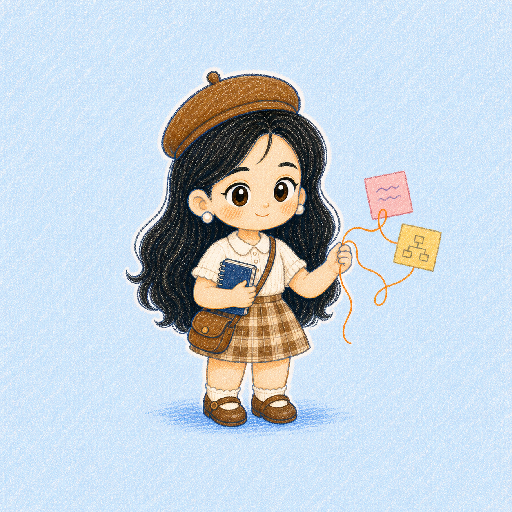

# Crayon Girl Illustrations

一个用于生成中文文章正文配图的 Codex Skill。

它会先理解文章中的观点、流程、状态和隐喻，再使用固定的两头身蜡笔女孩 IP，把内容转成温暖、清爽、易读的手绘解释图。



## 主要特点

- 生成 16:9 中文文章和公众号正文配图
- 支持文章配图规划和 shot list
- 固定两头身蜡笔女孩 IP
- 强制校验脸型、发型、头身、穿搭和配色一致性
- 支持流程、前后对比、概念隐喻、路线和新手解释图
- 每张图只围绕一个核心问题组织信息
- 可以复制、复用并继续修改成自己的 IP Skill

## 安装

真正需要安装的是仓库中的 `crayon-girl-illustrations/` 子目录。

### Windows PowerShell

```powershell
git clone https://github.com/dorlarosendo434-hub/crayon-girl-illustrations.git
Copy-Item -Recurse -Force `
  ".\crayon-girl-illustrations\crayon-girl-illustrations" `
  "$env:USERPROFILE\.codex\skills\crayon-girl-illustrations"
```

### macOS / Linux

```bash
git clone https://github.com/dorlarosendo434-hub/crayon-girl-illustrations.git
mkdir -p "${CODEX_HOME:-$HOME/.codex}/skills"
cp -R ./crayon-girl-illustrations/crayon-girl-illustrations \
  "${CODEX_HOME:-$HOME/.codex}/skills/"
```

安装后重新启动 Codex。

## 使用

### 分析文章配图位置

```text
Use $crayon-girl-illustrations 分析这篇文章哪里适合配图，
先输出 5 张左右的 shot list，不要立即生图。
```

### 直接生成正文配图

```text
Use $crayon-girl-illustrations 为下面这篇中文文章生成 4 张正文配图。
```

### 解释一个新手概念

```text
Use $crayon-girl-illustrations 用一张图向新手解释：
Skill 是什么、如何工作、能否复用和修改。
```

## 视觉规范

固定角色使用：

- 小号暖棕色贝雷帽
- 大头大脸、丰厚黑色长发
- 严格两头身
- 短而圆润的胖乎四肢
- 奶油色短袖上衣
- 高腰棕色格纹短裙
- 迷你圆角斜挎包和小皮鞋

每次生成后必须对照标准图进行形象一致性校验。明显改变脸型、发型、比例、服装或配色的图片不能直接交付。

## 目录

```text
crayon-girl-illustrations/
├── SKILL.md
├── agents/
│   └── openai.yaml
├── assets/
│   └── ip-reference/
│       └── 05-canonical-beret-plump-limbs.png
└── references/
    ├── composition-patterns.md
    ├── crayon-girl-ip.md
    ├── prompt-template.md
    ├── qa-checklist.md
    └── style-dna.md
```

## 来源

这个 Skill 基于 Ian 的
[ian-xiaohei-illustrations](https://github.com/helloianneo/ian-xiaohei-illustrations)
进行改造。原项目提供了正文配图工作流、渐进式 Skill 结构和原创隐喻方法。本项目重新设计了角色 IP、蜡笔视觉体系、两头身规范、新手解释图模式及形象一致性校验。

详细署名见 [NOTICE.md](NOTICE.md)。

## License

[MIT](LICENSE)
