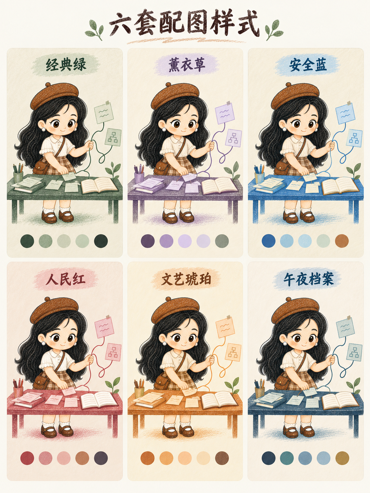

# 六套配色系统

## 选择规则

- 用户指定配色时严格使用指定方案。
- 用户未指定时，默认使用“经典绿”。
- 用户允许自动选择时，根据内容气质从下表选择；一组连续配图默认使用同一套配色，除非内容明确需要分章换色。
- 配色只控制背景、场景物件、路径、纸片、批注和少量线稿。当前用户 IP 在 `references/user-ip-profile.md` 中记录的发色、服装主色和标志性配饰属于身份锚点，不随主题色改变。

## 全局浅背景约束

- 整张图必须使用本色板指定的浅底色，浅色背景与留白覆盖画面至少 70%。
- 深色只用于轮廓、短文字、小面积结构和重点，禁止作为全幅背景、大面积色块、通栏标题底或强渐变。
- 单个深色块不超过画面约 12%，所有深色区域合计保持克制。
- 不要为了突出主题色而降低背景亮度；需要增强层级时，优先使用线条粗细、留白和浅色明度差。

## 01 经典绿

- 浅底：暖纸白 `#F0EBDD`
- 主色：森林绿 `#344C3D`
- 辅助：鼠尾草 `#8C9D83`
- 浅块：浅鼠尾草 `#CCD6BE`
- 深墨：炭绿 `#252F29`
- 适用：通用方法论、经验总结、长期主义、结构梳理。

## 02 薰衣草

- 浅底：暖棉纸 `#F4EFDF`
- 主色：梅子墨 `#51405D`
- 辅助：薰衣草 `#B6A0CA`
- 浅块：丁香纸 `#DFD5EA`
- 平衡色：鼠尾草灰 `#919C89`
- 适用：个人表达、情绪整理、慢思考、创作复盘。

## 03 安全蓝

- 浅底：象牙便笺 `#F1ECDC`
- 主色：安全蓝 `#356EAC`
- 辅助：冰蓝 `#BAD8E6`
- 浅块：薄荷纸 `#CFDCCB`
- 行动色：铜光 `#BA8048`
- 适用：AI 工具、教程、工作流、系统说明。

## 04 人民红

- 浅底：纪念碑象牙 `#F3E7D8`
- 主色：人民红 `#B44B4E`
- 辅助：会堂玫瑰 `#D28A8A`
- 稳定色：雪松棕 `#9C6A54`
- 深墨：会堂墨 `#3E3A44`
- 适用：观点表达、问题拆解、踩坑复盘、结论与警示。

## 05 文艺琥珀

- 浅底：纸张象牙 `#F8F0DD`
- 主色：焦橙 `#CD783B`
- 辅助：杏金 `#EDB36F`
- 浅块：桃霜 `#F5D8B7`
- 深墨：可可墨 `#785341`
- 适用：上手教程、创作过程、效率提升、成果展示。

## 06 午夜档案

- 浅底：羊皮纸白 `#F6F0E4`
- 主色：午夜墨 `#293F52`
- 辅助：档案青 `#527D7B`
- 浅块：蓝印 `#7E9FB8`
- 高亮：哑金 `#B59B62`
- 适用：知识库、资料整理、方法论沉淀、长期积累。

## 预览

